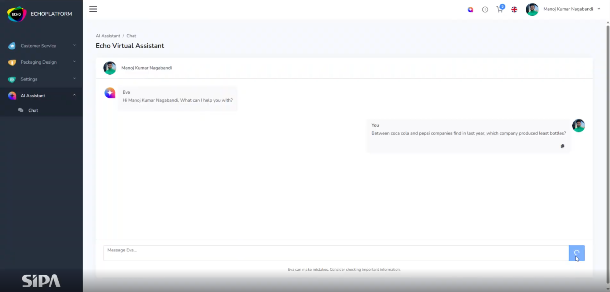
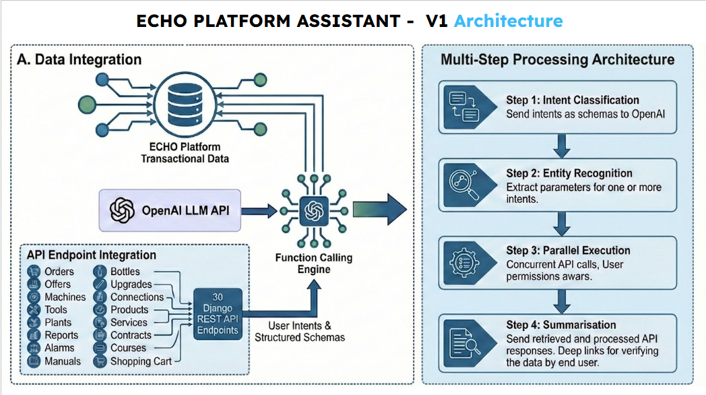
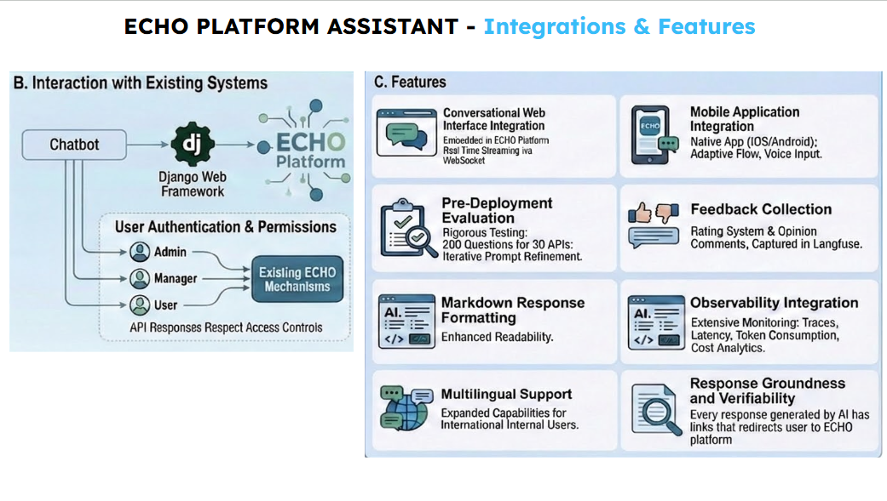
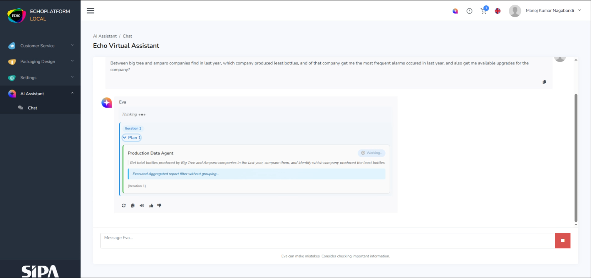
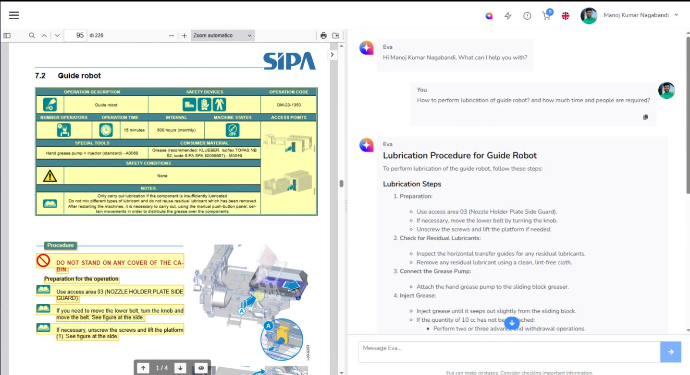
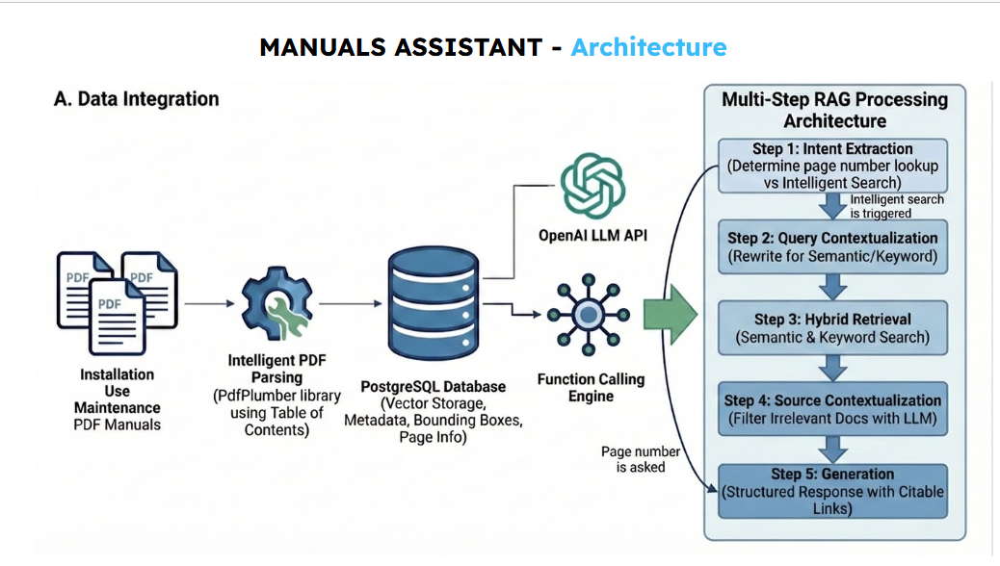
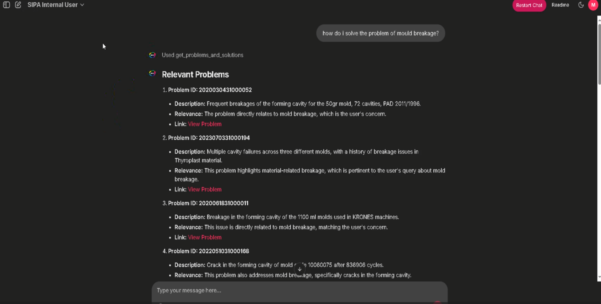
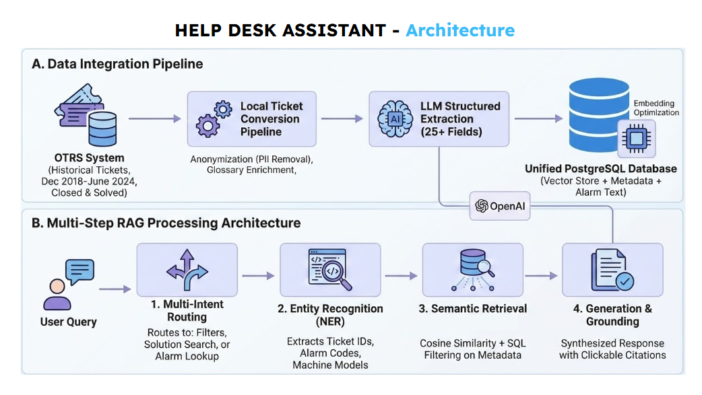
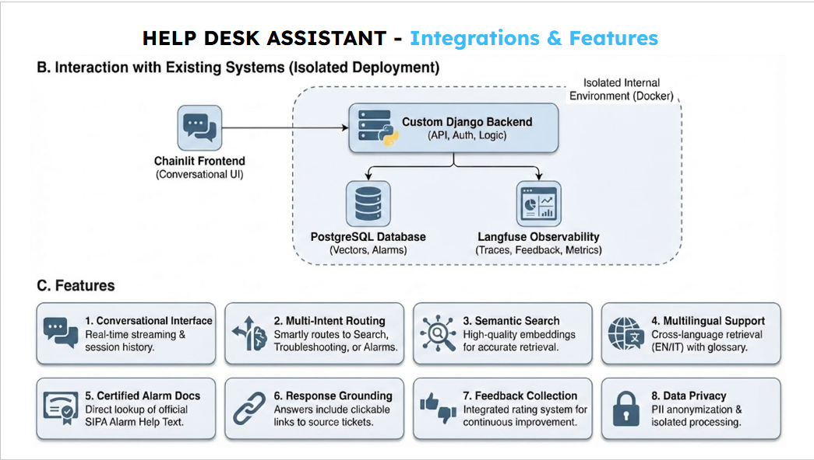

# Manoj Kumar Nagabandi

**AI Engineer · RAG & Multi-Agent Systems · LangChain · PydanticAI · FastAPI**

*Building production-grade AI systems - from architecture to deployment.*

📍 India → Italy → Stockholm, Sweden  |  🇮🇳 Indian · EU Long-Term Resident Visa

---

## Who I Am

I'm a Full-Stack AI Engineer with 3+ years of production experience building enterprise-scale AI systems. As the **sole AI engineer at SIPA SpA** (Zoppas Industries Group), I designed and productionised **AI** into **ECHO Platform**, an enterprise AI assistant ecosystem serving **3,000+ internal staff and customers globally**, that gives after sales services using ERP, CRM, PLM, ticketing, and IoT data streams through three specialised AI agents.

My work spans the full lifecycle: problem framing → system architecture → retrieval design → agent orchestration → evaluation → production deployment → LLMOps observability. I care about systems that are measurable, explainable, and maintainable at scale.

---

## What I've Built in Production

> Some projects below were built at SIPA SpA. Proprietary code lives on the company's internal GitLab.

### ECHO Platform - Enterprise AI Agent Ecosystem

**Multi-Agent multi-step real-time query system** connecting to 25+ live REST APIs (machines, orders, production data, alarms) via hierarchical intent classification → sub-agent identification parallell / sequential,  delegate / handoff → parallel function calling → parameter extraction → parallel sub-agent handoffed LLMs answer synthesis to user parallely (or) return to orchestrator for next step plan -> Final answer sysnthesis. Integrated into the platform backend via WebSockets + JavaScript front-end, with RBAC data security for 3,000+ users. Includes Langfuse observability, real-time user feedback loops, and continuous RAG evaluation.

`PydanticAI` `Django` `WebSockets` `Langfuse` `OpenAI` `PostgreSQL` `REST APIs` `RBAC`

---

### [Agentic FleetOps Copilot - Conversational Fleet Intelligence](https://github.com/knownbymanoj/agentic_fleetops_copilot)

Built a conversational fleet intelligence system that predicts truck component failures, explains risk with SHAP, and supports maintenance decisions through an agentic chat interface backed by FastAPI services. The project combines **PydanticAI, XGBoost, Langfuse, and a Scania-inspired fleet simulator**, using real predictive-maintenance patterns from the Component X dataset.

`PydanticAI` `FastAPI` `XGBoost` `SHAP` `Langfuse` `Predictive Maintenance` `Agentic Systems` `Simulator`

---

### Manuals Assistant - Hybrid RAG for Industrial PDFs

**Advanced hybrid RAG pipeline** for industrial PDF manuals (maintenance, installation, operational). Parses hierarchical document structures via Table of Contents, stores chapter/sub-chapter hierarchies in PostgreSQL with dynamic linking to pgvector embeddings (OpenAI text-embedding-3-large, dim=256) in AWS S3. Implements FTS + vector search fused with **Reciprocal Rank Fusion (RRF)**, LLM re-ranking, extractive summarisation with citations, and multi-turn query rewriting.

`RAG` `pgvector` `PostgreSQL` `AWS S3` `Hybrid Search` `RRF` `OpenAI Embeddings` `Langfuse` `Django`

---

### Customer Help Desk Assistant - Ticket Intelligence

**Data pipeline for historical service ticket retrieval**: PII removal via a domain-specific technical glossary, structured metadata extraction (alarms, machine models, issue types), and embedding-based indexing. Dual-mode retrieval: deterministic query mode (structured ticket search by parameters) + RAG semantic mode, with cited ticket references for traceability.

`RAG` `NLP` `Django` `PII Removal` `Metadata Extraction` `Semantic Search` `PostgreSQL` `LangChain` `Langfuse` `Docker`

---

### 📈 Multiple Time Series Forecasting - 4,200 Machines Simultaneously

Developed a forecasting solution predicting **alarm events and production cycle timing across 4,200 industrial machines at once**, enabling proactive maintenance scheduling. Applied **XGBoost + Transformer-based architectures (LSTM, ARIMA)** on large-scale industrial sensor data.

`XGBoost` `LSTM` `ARIMA` `Transformers` `Scikit-learn` `MLflow` `Time Series` `PySpark`

***

## 🎥 Project Architecture & Demos

###  EVA (Echo Virtual Assistant)

#### **Version 1: Workflow Based Single AI Agent**

[▶ Watch the demo video](https://drive.google.com/file/d/1e7ynm-rBylvi4d1bKy44CK4vWUCnThaM/view?usp=sharing)

##### **Architecture**

---

#### **Version 2: Planning based Multi-step Multi-agents using delagation/handoff to sub-agents using Orchestrator**

[▶ Watch the demo video](https://drive.google.com/file/d/19vl0LPuBBumn2boE3RaQKM7z5Oonic9R/view?usp=sharing)

### Manuals Assistant - Hybrid RAG for Industrial PDFs

[▶ Watch the demo video](https://drive.google.com/file/d/1welDVC23dEJkBv5_cCFPDoSCqXW7Xltw/view?usp=sharing)

**Architecture**

  
  

### Customer Help-Desk Assistant

[▶ Watch the demo video](https://drive.google.com/file/d/1pXB03IaWDlg9wmInGfZE0UNhU_yFDoIw/view?usp=sharing)

**Architecture**

  
  

### Agentic FleetOps Copilot - Conversational Fleet Intelligence

[**Architecture**](https://github.com/knownbymanoj/agentic_fleetops_copilot/blob/main/README.md#-web-ui-demo--3-simple-tools-walkthrough)

**Screenshots**

***

## 🛠 Tech Stack

**Generative AI & LLMs**

**Agentic & LLMOps**

**Backend & APIs**

**ML & Data Science**

**Databases & Storage**

---

## 🎓 Education

|Degree|Institution|Year|
|-|-|-|
|[M.Sc. Data Science](https://www.unipd.it/en/corsi-di-laurea/data-science) (Dep. of Mathematics)|University of Padova, Italy|2021 - 23|
|[B.Sc. Engineering Sciences](https://engineering-sciences.uniroma2.it/)|University of Rome Tor Vergata, Italy|2017 - 21|

---

## 🌍 Currently

* 🏢 Full-Stack AI Engineer @ **SIPA SpA** (Zoppas Industries Group) - Italy
* 🎯 Open to senior AI/ML Engineer roles in **Stockholm, Sweden** or any other location in **Sweden**
* 🌐 Languages: English · Italian · Hindi · Telugu
---

**[View & Download Resume](https://flowcv.com/resume/0e4p317okj)**

**Let's connect →** [**LinkedIn**](https://www.linkedin.com/in/manoj-nagabandi/)

